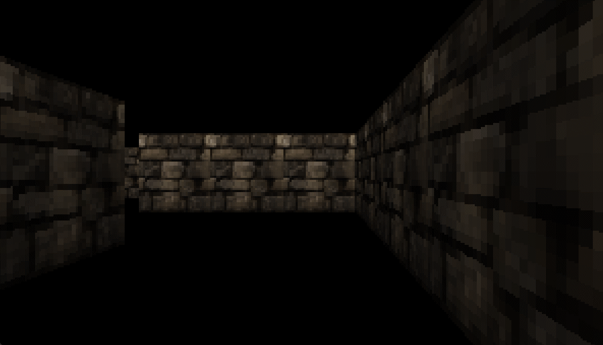

# Dungeon Raycaster
Trying to figure out raycasting

## Build Instructions
- Download the devel-mingw version of [SDL3](https://github.com/libsdl-org/SDL/releases/latest)
- Extract the `SDL3` folder containing headers to the include folder
- Create a `/bin` directory (in the main directory) and extract `SDL3.dll` into it
- Create a `/lib` directory (also in the main directory) and extract `libSDL3.dll.a` into it
- Do the same for [SDL_image](https://github.com/libsdl-org/SDL_image/releases/latest)
- Download the latest release of [chelp](https://github.com/thbop/chelp/releases/latest) and extract `libchelp.a` into the `/lib` directory and the headers into `/include`
- Run `make`, `dungeon.exe` should be generated in the `/bin` folder